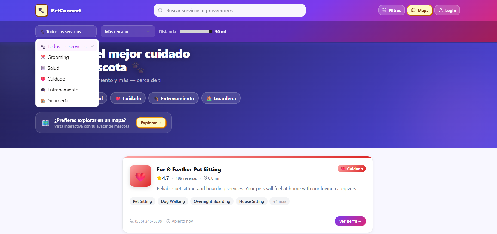
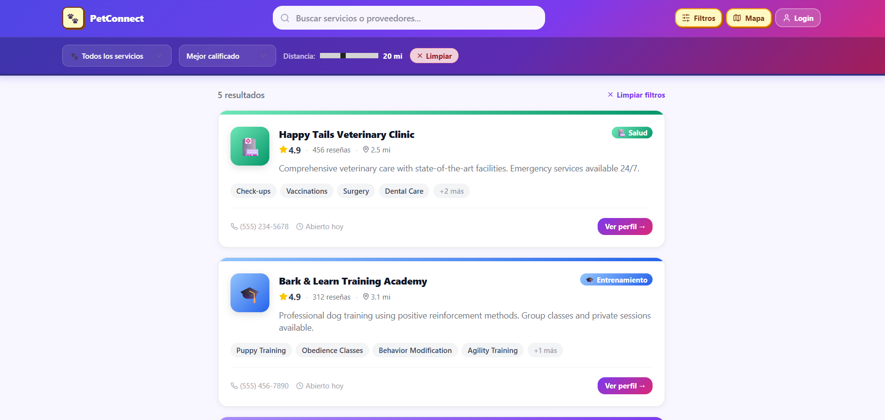
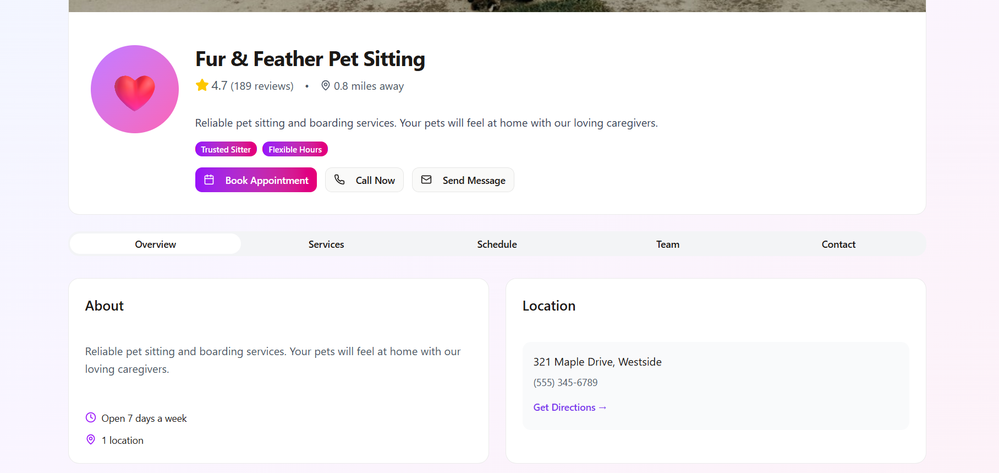
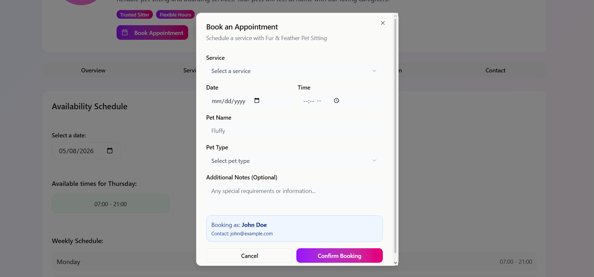
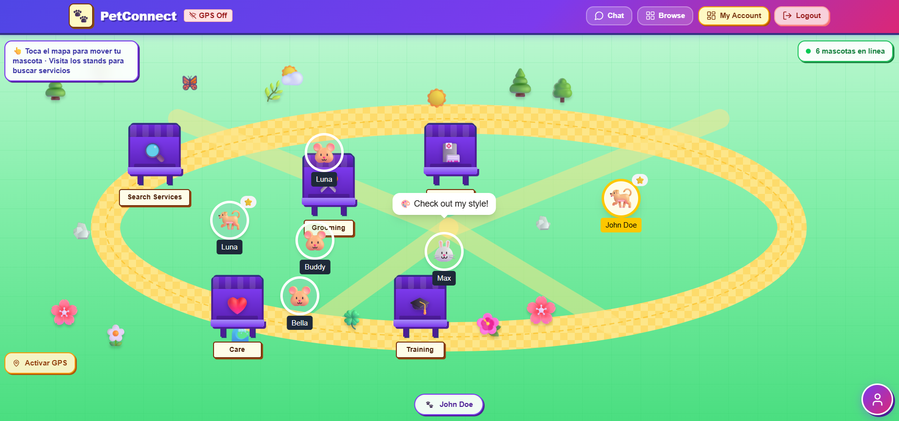
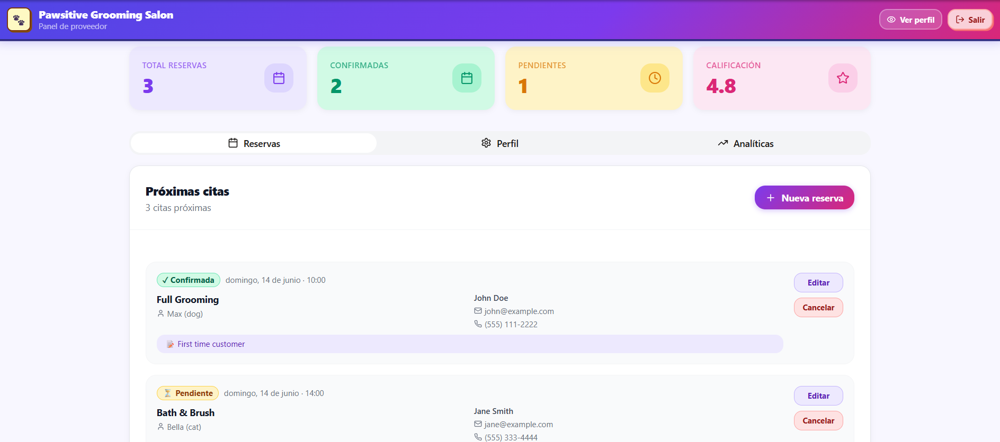
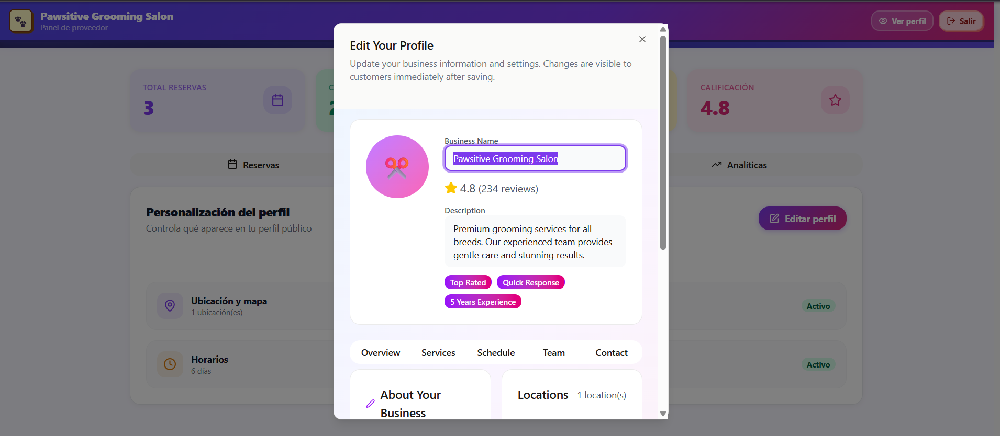

# 🐾 PetConnect

> **An integrated web platform that centralizes pet care services — search, compare, and book veterinarians, groomers, walkers, and boarding services in one place.**

[](https://react.dev/)
[](https://www.typescriptlang.org/)
[](https://vitejs.dev/)
[](https://tailwindcss.com/)
[](https://supabase.com/)
[](LICENSE)

---

## 📋 Table of Contents

- [Overview](#-overview)
- [Screenshots](#-screenshots)
- [Features](#-features)
- [Tech Stack](#-tech-stack)
- [Project Structure](#-project-structure)
- [Getting Started](#-getting-started)
- [Routes](#-routes)
- [Authentication](#-authentication)
- [Mock Accounts](#-mock-accounts)
- [SDG Alignment](#-sdg-alignment)
- [Contributing](#-contributing)
- [Authors](#-authors)

---

## 🌐 Overview

PetConnect solves a real, documented problem: the pet care services market is deeply fragmented. Pet owners must navigate multiple platforms, call businesses that never pick up, and rely on word of mouth to find reliable providers. Independent veterinarians and groomers, on the other hand, have little to no digital presence and depend entirely on referrals to fill their calendars.

PetConnect brings both sides together in a single web platform — no app installation required. Pet owners can browse, filter, compare, and book services in under five minutes. Service providers get a professional dashboard to manage appointments, handle walk-ins, and customize their public profile.

This project was developed as a UX Design final project, aligned with UN Sustainable Development Goals **3** (Good Health), **8** (Decent Work), and **11** (Sustainable Cities).

---

## 📸 Screenshots

> Add your screenshots to the `docs/screenshots/` folder and update the paths below.

### Browse & Search

| Landing / Browse View | Search Filters |
|---|---|
|  |  |

### Provider Experience

| Provider Profile | Booking Dialog |
|---|---|
|  |  |

### Interactive Map

| Map View |
|---|
|  |

### Provider Dashboard

| Dashboard | Profile Editor |
|---|---|
|  |  |

---

## ✨ Features

### For Pet Owners
- 🔍 **Browse without login** — explore all providers before creating an account
- 🗂️ **Filter & compare** — filter by service category, distance, and rating simultaneously
- 📅 **One-click booking** — short, conversational form with instant confirmation toast
- ⭐ **Verified reviews** — read and leave ratings for service providers
- 🐶 **Pet profiles** — store your pet's name, breed, and age for faster booking
- 🗺️ **Interactive map** — explore providers through a playful avatar-based world map

### For Service Providers
- 🏪 **Public profile** — showcase services, staff, hours, gallery, location, and social media
- 📊 **Provider dashboard** — manage all upcoming and past bookings in one view
- ✏️ **Walk-in entry** — manually add appointments for clients who book in person
- 🧩 **Widget system** — toggle profile sections on/off without touching code
- 🔔 **Booking notifications** — instant status updates for new and confirmed appointments

---

## 🛠️ Tech Stack

| Layer | Technology |
|---|---|
| Frontend framework | React 18 + TypeScript |
| Build tool | Vite 6 |
| Styling | Tailwind CSS v4 + Shadcn/ui |
| Component library | Radix UI primitives |
| Routing | React Router v7 (Data Mode) |
| State management | Context API (`AuthContext`) |
| Authentication | Supabase Auth (with localStorage mock fallback) |
| Database | Supabase (PostgreSQL) — scaffolded, ready to connect |
| Animations | Motion/React |
| Icons | Lucide React |
| Forms | React Hook Form |
| Toasts | Sonner |
| Date picker | React Day Picker |
| Drag & drop | React DnD |

---

## 📁 Project Structure

```
src/
├── app/
│   ├── components/
│   │   ├── ui/                  # Shadcn/ui base components
│   │   ├── AddBookingDialog.tsx  # Manual walk-in booking form (provider)
│   │   ├── AvatarCustomizer.tsx  # Pet avatar builder for map view
│   │   ├── BookingDialog.tsx     # User-facing booking form
│   │   ├── LoginDialog.tsx       # Auth modal (login + signup)
│   │   ├── PetAvatar.tsx         # Animated pet avatar for map
│   │   ├── ProfileEditor.tsx     # Provider profile widget editor
│   │   ├── ProviderCard.tsx      # Provider card for browse view
│   │   ├── SearchFilters.tsx     # Filter panel (category, distance, rating)
│   │   └── ServiceStand.tsx      # Map service stand nodes
│   ├── context/
│   │   └── AuthContext.tsx       # Global auth state (guest / user / provider)
│   ├── data/
│   │   └── mockData.ts           # TypeScript interfaces + seed data
│   ├── pages/
│   │   ├── MapView.tsx           # Interactive map with pet avatars
│   │   ├── ProviderDashboard.tsx # Provider management panel
│   │   ├── ProviderProfile.tsx   # Public provider profile page
│   │   ├── Root.tsx              # Layout wrapper with navigation
│   │   ├── ScrollView.tsx        # Browse / landing page (default)
│   │   ├── SearchResults.tsx     # Search results view
│   │   └── UserDashboard.tsx     # User booking history
│   ├── App.tsx
│   └── routes.tsx                # React Router route definitions
├── lib/
│   └── supabase.ts               # Supabase client initialization
└── main.tsx
```

---

## 🚀 Getting Started

### Prerequisites

- **Node.js** ≥ 18.0
- **pnpm** ≥ 8.0 (recommended) — or npm / yarn

### Installation

```bash
# 1. Clone the repository
git clone https://github.com/your-username/pet-service-social-portal.git
cd pet-service-social-portal

# 2. Install dependencies
pnpm install

# 3. Set up environment variables
cp .env.example .env
# Edit .env and add your Supabase credentials (optional — mock fallback works without them)

# 4. Start the development server
pnpm dev
```

The app will be available at `http://localhost:5173`.

### Build for Production

```bash
pnpm build
pnpm preview   # preview the production build locally
```

### Environment Variables

Create a `.env` file in the project root:

```env
VITE_SUPABASE_URL=your_supabase_project_url
VITE_SUPABASE_ANON_KEY=your_supabase_anon_key
```

> **Note:** Both variables are optional. If Supabase is not configured, the app automatically falls back to localStorage-based mock authentication, which works fully for development and testing.

---

## 🗺️ Routes

| Path | Component | Description |
|---|---|---|
| `/` | `ScrollView` | Default landing — browse all providers |
| `/browse` | `ScrollView` | Alias for the browse view |
| `/search` | `ScrollView` | Search results (same view, filtered) |
| `/map` | `MapView` | Interactive pet avatar map |
| `/provider/:id` | `ProviderProfile` | Public profile for a specific provider |
| `/dashboard` | `ProviderDashboard` | Appointment management (provider only) |
| `/account` | `UserDashboard` | Booking history (user only) |

---

## 🔐 Authentication

PetConnect supports three account types:

| Type | Description |
|---|---|
| `guest` | Default state — can browse and view profiles freely |
| `user` | Registered pet owner — can book, rate, and manage appointments |
| `provider` | Service provider — has access to the dashboard and profile editor |

Authentication is handled by **Supabase Auth**. When Supabase is not configured, the app falls back to a local mock system using `localStorage`, which supports login, signup, and session persistence across page refreshes.

---

## 🧪 Mock Accounts

The following test accounts are available out of the box when running without a Supabase backend:

| Role | Email | Password |
|---|---|---|
| Pet Owner | `john@example.com` | `password123` |
| Service Provider | `contact@pawsitivegrooming.com` | `provider123` |

You can also create new accounts through the sign-up flow — they are saved to `localStorage` and persist for the session.

---

## 🌱 SDG Alignment

| Goal | Target | How PetConnect contributes |
|---|---|---|
| **SDG 3** — Good Health and Well-Being | 3.8 | Improves access to veterinary care and encourages preventive pet health management |
| **SDG 8** — Decent Work and Economic Growth | 8.3 | Provides independent pet service workers a zero-cost digital marketplace |
| **SDG 11** — Sustainable Cities and Communities | 11.3 | Proximity-based search promotes local consumption and reduces unnecessary travel |

---

## 🤝 Contributing

Contributions, issues, and feature requests are welcome.

1. Fork the repository
2. Create a feature branch: `git checkout -b feature/your-feature-name`
3. Commit your changes: `git commit -m 'feat: add your feature'`
4. Push to the branch: `git push origin feature/your-feature-name`
5. Open a Pull Request

Please follow the existing code style and component conventions.

---

## 👩‍💻 Authors

| Name | Role |
|---|---|
| **Keren Daniela González García** | UX Design & Frontend Development |
| **Carlos Gabriel Estañol Solís** | UX Design & Frontend Development |

---

<div align="center">
  <sub>Built with ❤️ as a UX Design final project — 2026</sub>
</div>
